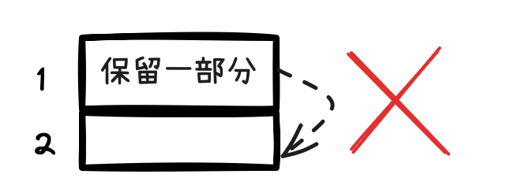
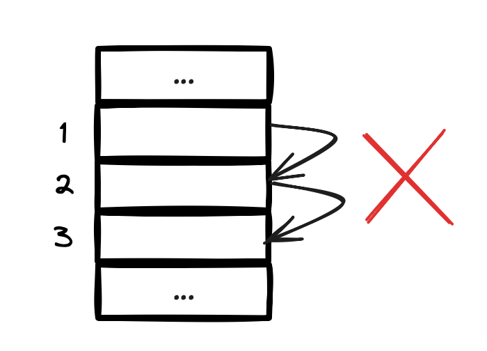
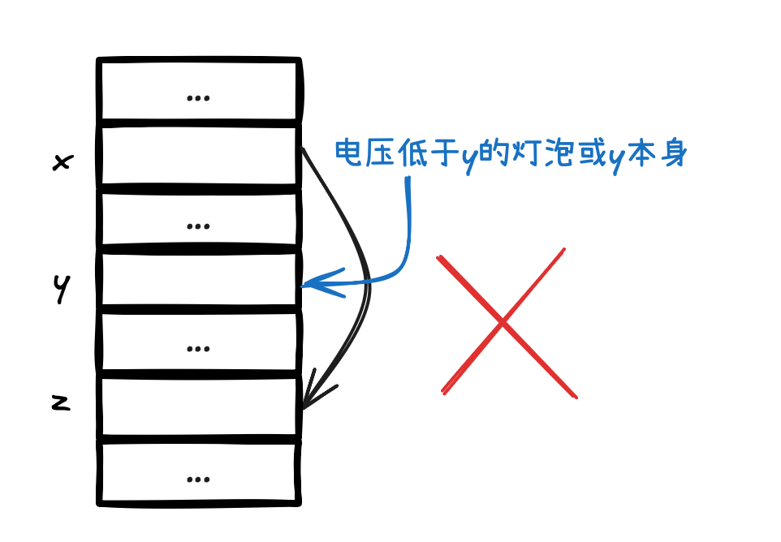
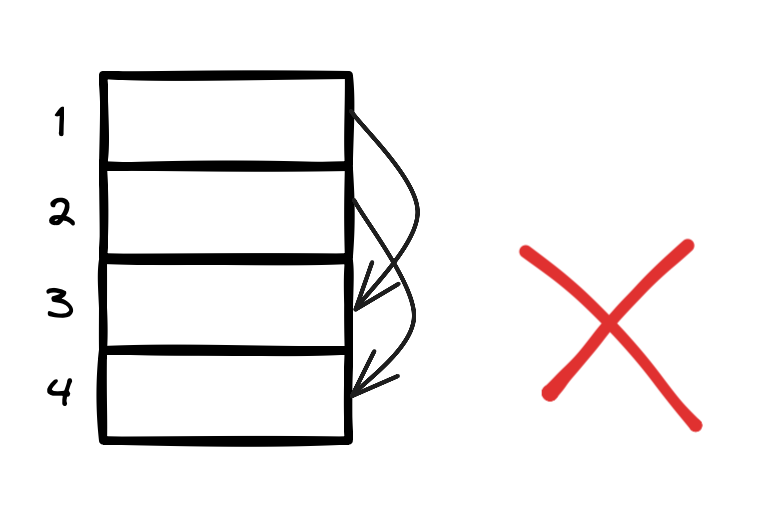
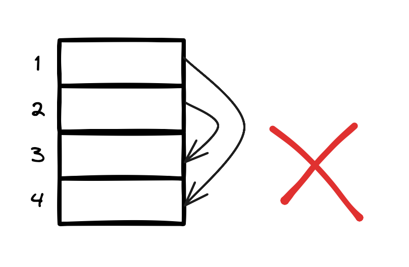
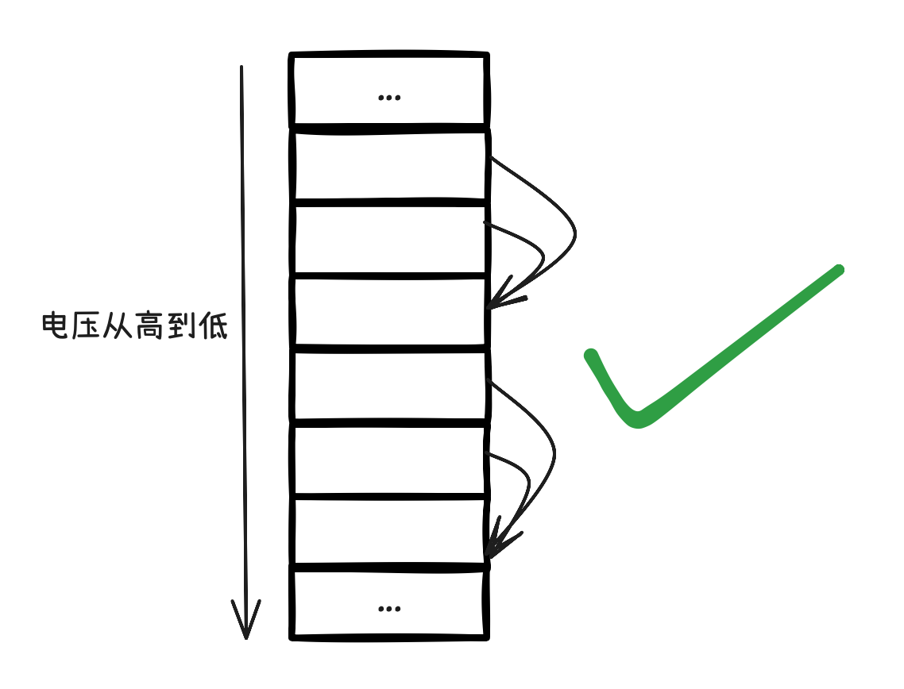
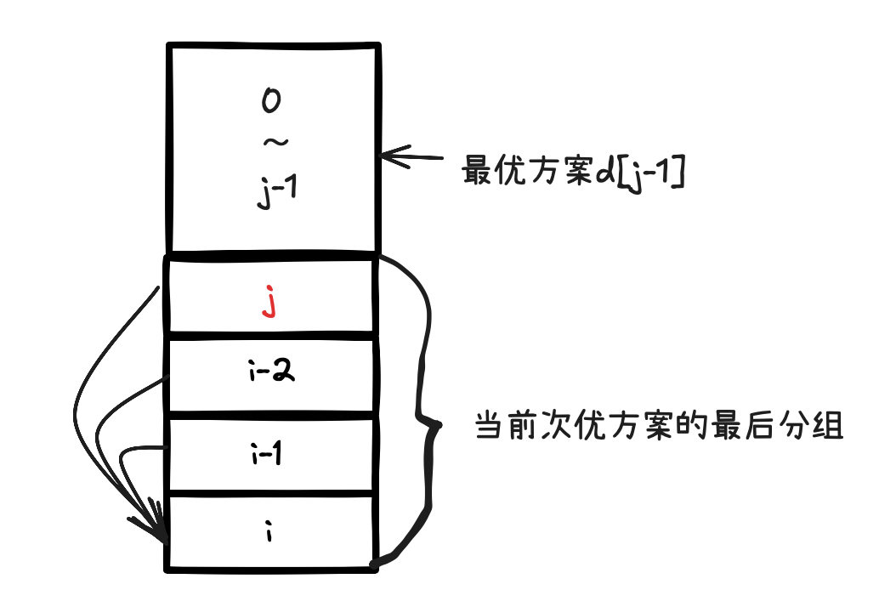

题意概括：买一定数量的灯泡，通过将低电压灯泡可以替换为高电压灯泡来节省成本，反过来不行，每种电压的电源可以带动无数个该电压的灯泡

需要注意的是，每种电压的灯泡都可以有多种替换方案（包括“不替换“）来节省成本
  1. 排除“部分替换”，“间接替换”，“嵌套替换”方案，他们要不就是明显可以优化，要不就是不会减少成本
  2. 剩下一些需要具体计算的“次优方案”
  3. 最后比较“次有方案”得出全局相关的唯一“最优方案”

理解并排除以下三种非次优方案（可以证明一定不是最优方案的候选）非常关键：
1. 不存在“部分替换”：每种灯泡的替换方式只有“全部替换”和“不替换”两种，但不可能“部分替换”
2. 不存在“间接替换”：若一种灯泡作为被替换的目标，则它不再可能再替换为别的灯泡，相当于该种灯泡不替换
3. 不存在“嵌套替换”：存在多种灯泡时，若低电压灯泡替换到高号灯泡，且中电压灯泡作为被替换到的目标或不替换（可以看作是一种“自替换”），则该方案一定不是最优方案，直接排除

我们接下来分别证明这三条结论。

## 排除“部分替换”
不可能部分替换这一点非常好证明

现有两种电压的灯泡

| 序号 | 电压 | 电源价格 | 灯泡单价 | 所需数量 |
| - | --- | --- | ---- | ---- |
| 1 | 低 | K<sub>1</sub> | C<sub>1</sub> | L<sub>1</sub> |
| 2 | 高 | K<sub>2</sub> | C<sub>2</sub> | L<sub>2</sub> |

当 C<sub>1</sub> >= C<sub>2</sub> 时，1号灯泡全部替换为2号灯泡明显优于部分替换（无论替换多少个），全部替换至少可以省下 K<sub>1</sub> 电源钱

当 C<sub>1</sub> < C<sub>2</sub> 时，将1号灯泡部分替换2号灯泡，只是在徒增成本。此时该采用哪种方案的关键，就是判断 因灯泡单价上涨而所需的钱 是否大于 买电源的钱
- 当 (C<sub>2</sub> - C<sub>1</sub>) * L<sub>1</sub> >  K<sub>1</sub> 时，也就是替换灯泡多出来的钱，比买1号灯泡的电源还多，则选择“不替换“
- 反之，选择“全部替换”，虽然灯泡单价更高，但通过不买1号灯泡的电源来省钱

得出结论一：**每种灯泡的替换方式只有“全部替换”和“不替换”两种，但不可能“部分替换”**

<div align="center">

</div>


从此节之后，将不再讨论“部分替换”，如提到替换，必然是“全部替换”。

## 排除”间接替换“

| 序号 | 电压 | 电源价格 | 灯泡单价 | 所需数量 |
| - | --- | --- | ---- | ---- |
| 1 | 低 | K<sub>1</sub> | C<sub>1</sub> | L<sub>1</sub> |
| 2 | 中 | K<sub>2</sub> | C<sub>2</sub> | L<sub>2</sub> |
| 3 | 高 | K<sub>3</sub> | C<sub>3</sub> | L<sub>3</sub> |

对于上面三种灯泡，存在这样的次优替换方案：1号 替换为 2号 ， 2号 替换为 3号

首先要明确的是，我们的最优替换方案是题目出来后就确定的，全局的，唯一的。替换不分步骤，也不分先后顺序。对于上面提出的替换方案，好像在说，我先这样替换，再那样替换，这其实是不存在的。对于上面这种替换方案，在不分先后的情况下，有二义性。
1. 将原来的2号灯泡全部替换为3号灯泡，然后将保留1号灯泡替换过来的2号灯泡。
2. 将原来的2号灯泡和1号替换过来的2号灯泡，均替换为3号灯泡。

其实很好证明，第一种情况是需要排除的，如果保留1号灯泡替换过来的2号灯泡，不就代表着2号灯泡发生了”部分替换“吗？”部分替换“的方案已经被我们否决了。

而第二种情况，我们其实可以干脆给他归类为这种方案：1号灯泡与2号灯泡，均替换为3号灯泡

得出结论二：**若一种灯泡作为被替换的目标，则它不再可能再替换为别的灯泡，相当于该种灯泡不替换**

<div align="center">

</div>

## 排除“嵌套替换”
剔除掉“部分替换”的方案后，接下来来看看怎么剔除一些不是那么好的，明显可以优化的方案。

1种灯泡谈不上替换，2种灯泡的情况我们其实已经在讨论过了（在排除“部分替换”节中）。现在来看下3种灯泡的情况

| 序号 | 电压 | 电源价格 | 灯泡单价 | 所需数量 |
| - | --- | --- | ---- | ---- |
| 1 | 低 | K<sub>1</sub> | C<sub>1</sub> | L<sub>1</sub> |
| 2 | 中 | K<sub>2</sub> | C<sub>2</sub> | L<sub>2</sub> |
| 3 | 高 | K<sub>3</sub> | C<sub>3</sub> | L<sub>3</sub> |

有一种方案我们在上一节已经讨论过了，就是“间接替换”，这里不再提出该方案。剩下还有以下方案。

1. 均不替换
2. 1号 替换为 2号
3. 1号 替换为 3号，2号不替换
4. 2号 替换为 3号，1号不替换

对于一号方案，有可能作为最优方案，比如当电压越小，灯泡单价和电源价格都越便宜的情况

对于二号方案，有可能作为最优方案，比如3号灯泡单价出奇的高，导致低电压灯泡就算加上电源价格都只能望其项背

先来看四号方案，其实与二号方案类似，设想1号灯泡和电源都非常便宜，而2号灯泡和3号灯泡都出奇的贵，只是2号相对3号便宜点

最后来看下三号方案，其实是可以证明出3号方案存在优化空间的（也就是说，3号方案一定不是最优方案，可以排除）

先来想想为什么2号不替换为3号，其实我们在“部分替换”节中讨论过，只有当(C<sub>3</sub> - C<sub>2</sub>) * L<sub>2</sub> > K<sub>2</sub> 时，也就是换灯泡不如买2号电源时才会发生，注意此时C<sub>2</sub> < C<sub>3</sub>。

那既然C<sub>2</sub> < C<sub>3</sub>，那为什么1号灯泡不替换成2号灯泡呢，明明灯泡单价更低呀，而且因为2号灯泡不替换，所以2号电源也必然是已经要买的。

我们发现三号方案是一定可以优化成二号方案的，所以我们可以直接排除掉这个一定不是最优的“一般方案”。

接下来，我们拓展一下这个例子，假设现在有多个灯泡
| 序号 | 电压 | 电源价格 | 灯泡单价 | 所需数量 |
| - | --- | --- | ---- | ---- |
... 上面是电压更低的灯泡
| x | 低 | K<sub>x</sub> | C<sub>x</sub> | L<sub>x</sub> |
...
| y | 中 | K<sub>y</sub> | C<sub>y</sub> | L<sub>y</sub> |
...
| z | 高 | K<sub>z</sub> | C<sub>z</sub> | L<sub>z</sub> |
...下面是电压更高的灯泡

在x号灯泡替换为z号灯泡的情况下，能不能采用中间的y号不替换的方案？

其实也是不能的，如果y号不替换，说明y号灯泡单价比z灯泡单价低，而且换成z号灯泡不如买y号电源。此时，x号灯泡不该替换成z号灯泡，而是替换成y号灯泡。

进一步扩展一下，在x号灯泡替换为z号灯泡的情况下，会不会出现“某种灯泡”替换到y号的情况
其实也是不能的，y号灯泡与z号灯泡会有单价高低之分
- 若z号灯泡单价更低，那“某种灯泡”和y号灯泡都应该替换到z号灯泡
- 若y号灯泡单价更低，就算加上y号电源也更划算（y号灯泡必不发生替换，详见结论二），那“某种灯泡”和x号灯泡都应该替换到y号灯泡，x号灯泡不应该替换成z号灯泡

至此，我们可以得出结论三：**存在多种灯泡时，若低电压灯泡替换到高号灯泡，且中电压灯泡作为被替换到的目标或不替换（可以看作是一种“自替换”），则该方案一定不是最优方案，直接排除**

<div align="center">

</div>

好了，到此为止其实已经讨论所有可能存在的替换方案，有一些替换方案可以直接通过以上三条结论直接排除。例如下面两种替换方案都违反了第三条结论。

<div align="center">


</div>

最后我们发现，三条结论过滤出来的**次优方案**只能差不多是长这个样子，没有相互交叉的箭头，而我们将通过计算比较这些次优方案得出最优方案
<div align="center">

</div>


## 动态规划
观察上节的最后一张图片，我们可以发现灯泡的“次优方案”将灯泡们分成一组一组的，每一组中，所有灯泡都替换成该组中最后一种灯泡（不替换也可以看成自成一组）。

我们往最后添加一种最高电压的灯泡时，最后一组灯泡的替换方案将发生变化，从而导致除开最后一组的所有前面灯泡的替换方案也发生变化。此时我们就需要利用动态规划的记忆性质，直接得到前面所有灯泡的最优方案。

现假设灯泡都已经按电压排序（从0开始计数）,d[i]表示从0号灯泡到i号灯泡的**最优方案**的成本,sum[i]表示从0号灯泡到i号灯泡的所需灯泡总数量

灯泡按电压一个一个添加上去，每当添加一个最高压灯泡时，**我们遍历最后一组灯泡分组的所有可能性**（这将产生许多次优方案，之后将比较它们），而前面的所有灯泡的最优方案成本我们已经在之前的遍历中计算过了，直接拿来用

<div align="center">

</div>

状态转移方程：`d[i] = Math.min(d[i],d[j-1] + (sum[i] - sum[j-1]) * lights[i].c + lights[i].k)`，其中
- j号灯泡是最后分组的开头第一个灯泡
- 0～j-1号灯泡的最优方案已经在之前的遍历中计算出来了
- j～i号灯泡为最后一组灯泡


```java
int[] d = new int[n];
d[0] = lights[0].l * lights[0].c + lights[0].k;
for (int i = 1; i < n; i++) {
    d[i] = sum[i] * lights[i].c + lights[i].k; //先假设全部灯泡替换成i号灯泡

    // 将 j～i号灯泡 替换成 i号灯泡，而0～j-1号灯泡的最优方案成本之前已经算过了，直接拿来用
    for (int j = 1; j <= i; j++) {
        d[i] = Math.min(d[i],d[j-1] + (sum[i] - sum[j-1]) * lights[i].c + lights[i].k);
    }
}
```

## 完整代码
```java
import java.util.Arrays;
import java.util.Comparator;
import java.util.Scanner;

public class UVa11400 {
    public static void main(String[] args) {

        Scanner sc = new Scanner(System.in);
        while (sc.hasNext()) {

            int n = sc.nextInt();
            if (n == 0)
                break;

            // 读入数据，并将灯泡按电压种类排序
            Light[] lights = new Light[n];
            for (int i = 0; i < n; i++) {
                lights[i] = new Light(sc.nextInt(), sc.nextInt(), sc.nextInt(), sc.nextInt());
            }
            Arrays.sort(lights, Comparator.comparingInt(l -> l.v));

            // 当前电压与小于当前电压的灯泡所需数量和
            int[] sum = new int[n];
            sum[0] = lights[0].l;
            for (int i = 1; i < n; i++) {
                sum[i] = sum[i - 1] + lights[i].l;
            }

            // 0～i号灯泡的最小成本
            int[] d = new int[n];
            d[0] = lights[0].l * lights[0].c + lights[0].k;
            for (int i = 1; i < n; i++) {
                d[i] = sum[i] * lights[i].c + lights[i].k; //全部替换成i号灯泡

                // 将 j～i号灯泡 替换成 i号灯泡，
                for (int j = 1; j <= i; j++) {
                    d[i] = Math.min(d[i],d[j-1] + (sum[i] - sum[j-1]) * lights[i].c + lights[i].k);
                }
            }


            System.out.println(d[n-1]);

        }


    }

}

class Light {
    int v; // 电压
    int k; // 电源价格
    int c; // 灯泡单价
    int l; // 所需数量

    public Light(int v, int k, int c, int l) {
        this.v = v;
        this.k = k;
        this.c = c;
        this.l = l;
    }
}


```