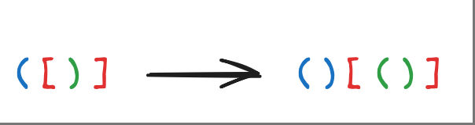
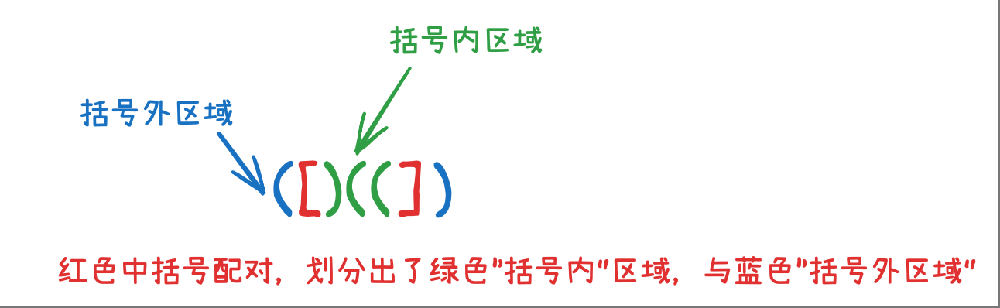
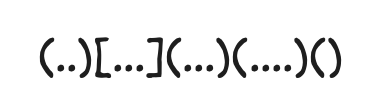
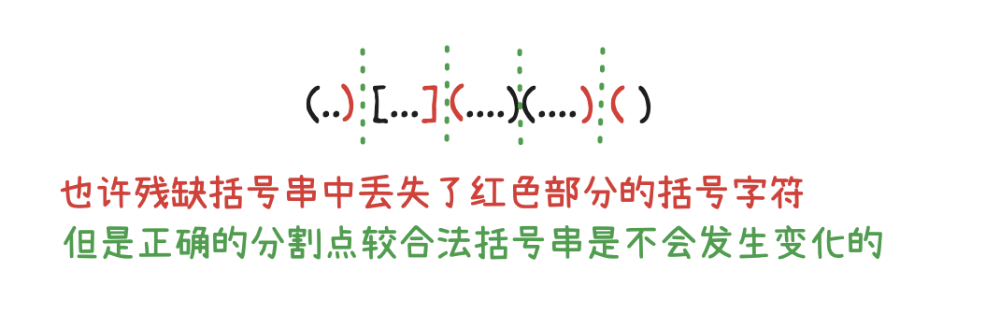

题意概括：加上最少的括号，使原来的残缺括号串变成合法的括号串，我们称之为**最小括号串**，例如`（[）]`变成`()[()]`

假设最后生成的最小括号串是唯一的，那么其中每一个括号字符都有与它配对的括号字符，**那么我们的目标其实就是找出原残缺括号串中，已经存在的最小括号串中的括号配对，然后再补全缺少配对的括号**。例如，下面图片中红色中括号是残缺括号串中已有配对：

<div align="center">

</div>


对于一个左括号，在残缺括号串中可能会存在多个右括号可以与之匹配。但在最小括号串中，只有其中一个右括号，或干脆没有（如上例）右括号，与这个左括号匹配。对于一个右括号也是同理。

**当我们选定一对括号成为一组配对时，原括号串将被划为两个区域，即“括号内”与“括号外”，分别在两个区域中的左右括号将无法组成括号串**

<div align="center">

</div>

对于一个**合法括号串**，一定是由一个或多个同级的最外层括号组成的，如下图
<div align="center">

</div>
注意这里说的是合法括号串，而不是最小括号串，上图每个括号里都可以再包含一个合法括号串，而这些合法括号串也可以有上图的特性
在最小括号串中的每个合法括号串（可以递归），都对应着残缺括号串中的局部。

<div align="center">

</div>

我们的只要在对应的**局部**残缺括号串中，找出这些最外层括号之间的分割点。

`d[i][j]` 代表 `i～j残缺括号子串` 所需要补充括号的最少数量。

对于`i～j残缺括号子串`，如果找到正确的最外层括号分割点，则“需要补充的括号数量”最少
```java
public static void dp() {
    for (int i = 0; i < len; i++) {
        d[i][i] = 1; //只有一个括号字符，必定需要补上另一半
        d[i+1][i] = 0; //已经是最里层的括号了
    }
    for(int start = len-2; start >= 0 ; start--) {
        for(int end = start+1; end < len; end++) {
            d[start][end] = len; // 最多增长为原来字符串的两倍
            // 分割括号串 的情况
            // 其实就是找出当前最外层括号对之间的分割点，正确的最外层分割点能让“需要补充的括号数量”最少
            for(int k = start; k < end; k++) {
                d[start][end] = Math.min(d[start][end], d[start][k] + d[k+1][end]);
            }
            // 不分割 且 两头刚好能组成一对括号的情况
            // 如果两头不能组成一对括号，或者不是最优配对法，那么最优配对已经在前一种（分割）的情况里了
            if(isBuddy(s[start], s[end])) {
                d[start][end] = Math.min(d[start][end], d[start+1][end-1]);
            }
        }
    }
}
```    


## 未完待续
1. 遍历顺序有讲究
2. 对于找不到配对的括号，最好的配对方法，就是直接在他相邻位置补上一个配对的括号，此时自然就变成了AB形式的括号串,也就是在每个合法括号串的最外层。所以最后一张图片是错误的